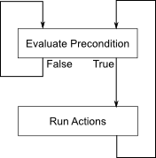

Quick Start Guide
=================

Installing Darbs
-------------------
First of all you need to install a copy of DARBS.  Follow the :doc:`install` and then come back to get up and running with your first DARBS application.

Running and talking to the Blackboard
----------------------------------------
At the heart of DABRS is the :doc:`blackboard`.  The Blackboard provides a way to store, retrieve and modify knowledge, which is stored as XML data.  Perhaps the best way to get acquainted with the Blackboard is by trying it out using the :doc:`terminal` application.  So, let's give it a go.

First open up a command line and run the Blackboard application (blackboard on Linux or OSX, blackboard.exe on Windows).  You should see an empty prompt.

Leaving the Blackboard running in the background, start up the DARBS terminal application in a second command line (darbsterminal on Linux or OSX, darbsterminal.exe on Windows).  Again you should see an empty prompt.  From the terminal prompt you can issue "requests" to the server.  Try typing the following into the terminal prompt, and hitting enter::

    <request type="add"><partition name="quick_start"><pattern>My first DARBS request</pattern></partition></request>

If you've typed it correctly you should see the following response from the Blackboard::

    <?xml version="1.0"?>
    <response>
        <partition name="quick_start">
            <pattern>true</pattern>
        </partition>
    </response>

So what's just happened?  We can see by going through each part of the request individually.

* <request type="add">
    Tells the Blackboard that we want to add a piece of knowledge to its memory.
* <partition name="quick_start">
    Tells the Blackboard to store the data on a partition named "quick_start".  Data on the Blackboard is stored in named partitions, allowing you to provide a higher level organisation to the information stored.
* <pattern>My first DARBS request</pattern>
    Tells the Blackboard to store the pattern "My first DARBS request".  Partitions consist of a series of patterns embodying a single piece of knowledge.

To see the result of adding the data to the Blackboard we can use the get command to return the entire contents of the Blackboard.  In the terminal type the following and hit enter::

    <request type="get" />

You should get the following response::

    <?xml version="1.0"?>
    <response>
        <partition name="quick_start">
            <pattern>My first DARBS request</pattern>
        </partition>
    </response>

**Activity** - Try using the terminal to send a request which adds the pattern "My second DARBS request" to the quick_start partition on the Blackboard.  Use the get command to check whether you were successful.

**Activity** - Try out the different request types described in the :doc:`blackboard` help file.

Your first agent
---------------------------
Now you've got an idea of how communication with the Blackboard works it's time to start working on creating a fully working system.  First of all though, let's start with a clean slate.  Clear the Blackboard by running the following request from your terminal::
    
    <request type="clear" />

Agents are the brains of any DARBS system.  They are responsible for everything from adding data to the Blackboard and making decisions based upon the content, to calling external functions, and pretty much anything else you might want to do.  To get an idea of how agents work we'll dive into the deep end with your first agent.  Open up a text editor and paste the following into a file, saving it as VehicleClassification.dkf::

    <agent name="Vehicle Classification" type="rule-based">
        <precondition type="not">
            <request type="present">
                <partition name="control">
                    <pattern>
                        Vehicle classification complete
                    </pattern>
                </partition>
            </request>
        </precondition>

        <action>
            <request type="add">
                <partition name="control">
                    <pattern>
                        Vehicle classification complete
                    </pattern>
                </partition>
            </request>
        </action>
    </agent>

In this state the agent doesn't do anything useful, but it is complete, so let's run it and see what happens.  To run agents from the command line in DARBS you need to use the program agentclient (or agentclient.exe).  So from a command line run the following::
    
    agentclient VehicleClassification.dkf

Nothing visible should happen, but if you use your terminal to run a get request as you did earlier on, you should see the following::

    <response>
        <partition name="control">
            <pattern>
                Vehicle classification complete
            </pattern>
        </partition>
    </response>

So what has happened?  To work it out we'll go through the agent section by section.  First of all we have::
    
    <agent name="Vehicle Classification" type="rule-based">

This is fairly simple - we declare that the file defines an agent, and give it a name.  The final attribute defines the type of agent we are creating.  DABRS contains different types of agent for working with data in different ways.  In the next section you will see why we have chosen a rule based agent, but for now you can forget about this part.  Next we have::
    
   <precondition type="not">
        <request type="present">
            <partition name="control">
                <pattern>
                    Vehicle classification complete
                </pattern>
            </partition>
        </request>
    </precondition> 

You should recognise most of this as a request to be sent to the Blackboard.  The request checks whether the pattern "Vehicle classification complete" exists on the "control" partition of the Blackboard.  The part you won't be familiar with is <precondition type="not">.  The first section of any agent is a precondition which is evaluated to see whether the agent should take any further action.

The precondition's type attribute allows you to perform boolean logic operation on the result of the precondition.  So here, with the "not" type, the precondition evaluates true if the pattern is absent from the partition, and false if the pattern is present on the partition.  The precondition therefore evaluates true on the first run through with an empty Blackboard, so the agent is free to carry on to the next section, where we have::

    <action>
        <request type="add">
            <partition name="control">
                <pattern>
                    Vehicle classification complete
                </pattern>
            </partition>
        </request>
    </action>

Again, you should recognise the Blackboard request contained within the action tags.  Also note that it is adding the same string that the precondition was checking for earlier.  The unfamiliar part is the <action> tag.  Actions are the final part of any agent.  They run requests if the precondition evaluates true.  So in this case we add the pattern "Vehicle classification complete" to the "control" partition of the Blackboard.  This means that when the precondition is looked at for a second time it will evaluate false, as the pattern exists.  In essence this acts as a guard so the actions are only run once (unless the Blackboard is further modified to remove the "Vehicle classification complete" pattern).

To sum quite a lot of this up in a picture, the basic run loop of an agent looks something like this:

**Activity** - Try adding a further action to the agent and check it works using a get request

Writing the rules
--------------------
Although you now have your first agent up and running, it doesn't do anything particularly useful.  To rectify this we will now build your simple first agent into a system for classifying types of vehicle based upon their characteristics.  You may remember earlier that we we set the type of agent to be rule based.  Rule Based agents add an extra stage between evaluating the precondition and running the actions, where a number of rules are evaluated.  To get started with your first rule, copy and paste the following into a new file called AddData.drf::
    
    <rule name="AddData">
        <precondition type="not">
            <request type="present">
                <partition name="control">
                    Data has been added
                </partition>
            </request>
        </precondition>

        <action>
            <request type="add">
                <!-- Add vehicle type definitions -->
                <partition name="definitions">
                    <pattern>
                        A car has 4 wheels, is medium weight, and is a passenger carrier
                    </pattern>
                </partition>

                <!-- Add information about vehicles -->
                <partition name="wheels">
                    <pattern>
                        Vehicle A has 4 wheels
                    </pattern>
                </partition>
                <partition name="weight">
                    <pattern>
                        Vehicle A is medium weight
                    </pattern>
                </partition>
                <partition name="carrier">
                    <pattern>
                        Vehicle A is a passenger carrier
                    </pattern>
                </partition>

                <partition name="control">
                    <pattern>
                        Data has been added
                    </pattern>
                </partition>
            </request>
        </action>
    </rule>

There's quite a lot of XML there, but if you look through you should recognise it as being almost identical to your agent.  In fact, rules work almost identically to agents, with a precondition being evaluated, and if it is true the actions being run.  Going back to our first rule you can see that despite the length it is actually very simple.  It first checks whether there has already been data added to the Blackboard, and if it hasn't then it adds a number of bits of data defining the characteristics of a car and different aspects of an unclassified vehicle.

To make sure that the rule works as advertised we need to add it to our agent so it is evaluated.  This is done by simply adding a rule tag between the precondition and the action in the file VehicleClassification.dkf.  With the rule tag added the middle of your agent should look like::

    ...
    </precondition>

    <rule>
        AddData.drf
    </rule>
    
    <action>
    ...

To make sure the rule is working, clear the Blackboard and run the agent using agentclient as usual.  If you then check the contents of the Blackboard you should see that the data has been added to the appropriate partitions.

**Activity** - Add a definition for a bicycle and a van to the definitions partition.  Run the agent and check the contents of the Blackboard using a get request.

**Activity** - Add a second set of information about a vehicle matching your definition of a bicycle or van.  Run the agent and check the contents of the Blackboard using a get request.

Now we have the rule for adding data to the Blackboard we need a second rule to work out what type of vehicles we have, from the information given.  To do this we need to introduce a new feature of DARBS - the use of wildcards and pattern matching.  From the DARBS terminal try running the following request::

    <request type="get"><partition name="wheels"><pattern>Vehicle ?id has ?wheels wheels</pattern></partition></request>

You should get a response which looks something like::
    
    <?xml version="1.0"?>
    <response>
        <partition name="wheels">
            <pattern>
                <key name="id">
                    <match>A</match>
                    <match>B</match>
                </key>
                <key name="wheels">
                    <match>4</match>
                    <match>2</match>
                </key>
            </pattern>
        </partition>
    </response>

You can see that in the get request we use named wildcards (?name), and the Blackboard returns the values which match them in the patterns stored.  In the context of an agent this means that rather than acting on a single pattern, we can work with any number of patterns which follow a common format.  To see this in action we can start to build our classification rule.  Paste the following into a new file name Classify.drf::

    <rule name="Classify">
        <precondition>
            <precondition>
                <request type="get">
                    <partition name="wheels">
                        <pattern>
                            Vehicle ?id has ?wheels wheels
                        </pattern>
                    </partition>
                    <partition name="weight">
                        <pattern>
                            Vehicle == is ?weight weight
                        </pattern>
                    </partition>
                    <partition name="carrier">
                        <pattern>
                            Vehicle == is a ?carrier carrier
                        </pattern>
                    </partition>
                </request>
            </precondition>

This first precondition grabs the number of wheels, weight, and carrier type for each of the vehicles from the Blackboard in a similar way to the request you just used in the terminal.  There are a couple of little tricks to notice here.  Firstly, the get request returns false if there are no matches to your patterns, so subsequent actions will not run if there is no data on the Blackboard.  Secondly, the last two patterns we match use the == wildcard instead of ?id.  The == wildcard acts as an unnamed match, so we don't overwrite the id variable for each partition.

**Activity** - Using the terminal try running one of the requests using the == wildcard

Having used the get request to find the relevant data about each of the vehicles we are trying to classify, we need to actually do the classification.  To do this we need to use variable substitution in a second precondition.  Add the following to the end of Classify.drf::

    ...
        <precondition>
            <request type="get">
                <partition name="definitions">
                    <pattern>
                        A ?vehicleType has ~wheels wheels, is ~weight weight, and is a ~carrier carrier
                    </pattern>
                </partition>
            </request>
        </precondition>
    </precondition>

In the pattern, the tilde character (~) is used to substitute the values of matched variables from earlier earlier preconditions.  So for example, ~wheels would be replaced by the values matched using ?wheels.  This second precondition therefore checks to see whether we have a matching definition for each vehicle.  If we have, it subsequently stores the vehicle type.  In essence it classified the vehicles based upon whether they match the definition string.

Finally, then, having classified the vehicles we need some way to find out what the outcome was.  To do this we can use the report request as an action to simply print the information to the command line.  Again we can use variable substitution to do this.  The final part of Classify.drf is::

    ...
        <action>
            <request type="report">
                <pattern>
                    Vehicle ~id is a ~vehicleType
                </pattern>
            </request>
        </action>
    </rule>

Try running your agent with an empty Blackboard.  You should see the results of the classification.  If so, congratulations!  You have just made your first simple DARBS application.

What next?
----------
Now you are up and running, have a quick flick through the rest of the DARBS documentation.  A number of aspects of this tutorial are covered in somewhat more detail, and also more advanced features (such as adding your own functionality to DARBS) are covered.  From there, have a look through the examples directory, and try building your own systems based upon what you've learned.
